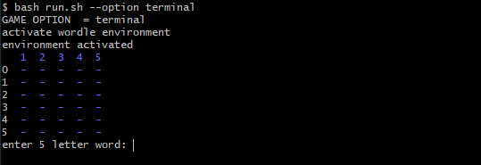
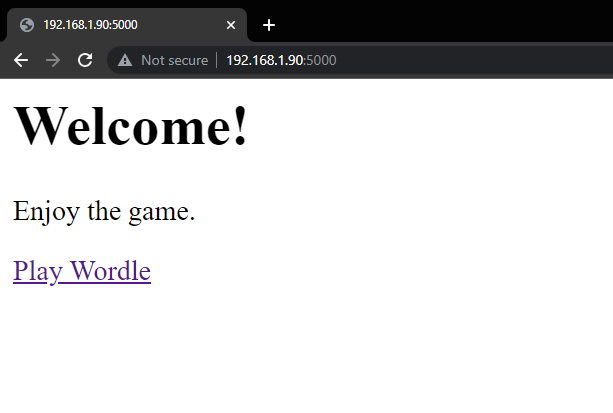

# wordle
A simple implementation of wordle using Flask and Python.

## Requirements
- [Anaconda](https://www.anaconda.com/)

## Setup

To run the app, first clone this repository and cd into `wordle/`. Using the command line (I recommend Git bash if using windows), call the `run.sh` script. Here is the usage:

```
# run.sh
# usage: bash run.sh --option [flask|terminal]
```
To run the terminal client:

`$ bash run.sh --option terminal`

Here is the terminal output:



To run the Flask application:

`$ bash run.sh --option flask`

Here is the flask home page and Game page:




